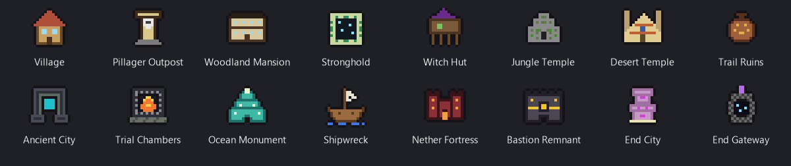

# Sky's Structure Map

**[⬇ Download the latest version](https://github.com/SkyStormer1/SkysStructureMap/releases/latest)**
&nbsp;·&nbsp; Minecraft 26.2 · Fabric · client-side

A client-side Fabric mod that remembers the structures you come across, so you never have to write down coordinates
again. It puts every structure you find on **Xaero's World Map and Minimap**, with its own icon.

> **Alpha.** This is an early version for testing. It works, but expect rough edges and changes between versions.

## How it works

As you explore, the mod recognises structures from the blocks your game has already loaded. It doesn't need the
seed, a server plugin or any help from the server, and nothing in it works out or uses the world seed. When you
come within 32 blocks of a structure, it's saved as discovered and shows up on your map.

Each kind of structure is recognised from blocks that only it generates, chosen by counting the blocks in the
game's own structure designs:

- **Ocean monuments** are always the same building on the same grid, so their exact box is known.
- **Shipwrecks, pillager outposts, villages, trail ruins and end cities** are matched against the game's own
  designs: a wreck in any wood, an outpost's watchtower, a village's town centre around its bell (or where its
  streets meet, if a raid took the bell), a trail ruins tower, an end city's rooms, towers or ship. The match allows for broken or added blocks, but a player's build
  that only uses the same blocks does not pass.
- **Nether fortresses** need a bridge crossroads, **strongholds** their end portal frames, **trial chambers** a
  trial spawner or vault, and **witch huts** their exact size.
- **Bastions** need the share of cracked bricks the game leaves when it builds one, and **woodland mansions** their
  mix of materials at scale, red carpet down every corridor included.
- **Everything else** is mapped out from its blocks as you see more of it.
- Each kind is only looked for in the biomes the game generates it in, so a player's base elsewhere is never
  taken for one. Outposts and villages only need part of themselves in the right biome, since they often reach
  over into a beach or river beside it.

## Features

- **Spawn boxes**, like MiniHUD's but without the seed: the boxes that structures with mobs of their own spawn
  them in, drawn in the world around you and on the world map.
  - **Nether fortresses:** the whole fortress box, and each bridge crossroads (the pieces wither skeletons and
    blazes spawn in), both exact.
  - **Ocean monuments, pillager outposts, witch huts:** their exact boxes.
  - Kept once found, so they stay after you tear the structure down.
  - Turn them off on the map or in the world under Set, or bind a key in Controls to show and hide them in the world.
- **Icons on the world map and minimap** for every structure you've discovered. Hover one on the world map for
  its coordinates and size.
- **A legend** on the world map, listing the structures that can exist in the dimension you're looking at, with
  how many you've found.
  - Click a line to show or hide that kind.
  - Drag the header to move the legend, click the header to fold it away, and drag the bottom edge to show more
    or fewer lines. It scrolls with the mouse wheel.
  - **Box** draws every structure's outline, **Near** shows ones you've seen but not discovered yet, and **Set**
    opens the settings.
- **Right-click an icon** to make a Xaero's Minimap waypoint, copy its coordinates, show or hide its outline, share
  it, mark it as completed, or delete it.
- **Completed** structures get a green tick beside their icon, on the world map and minimap, so you can see at a
  glance which ones you've already looted or cleared. Right-click again to mark one as not completed.
- **Share** a structure with everyone in chat, or privately with the players you pick. Anyone with this mod gets
  an **[Add to my map]** button that puts it on their map. It's one plain line of chat, so anyone without the mod
  sees its name, coordinates and box, and no code.
- **Settings** (the legend's Set button, or Mod Menu):
  - **Show structures**, one switch for everything the mod draws, and **Hide completed**, which leaves the ones
    you've finished with off the maps,
  - icon size on the world map and minimap,
  - how close counts as discovering a structure (or only when you're inside it),
  - a chat line when you discover one,
  - the command used for private shares (`tell` by default).
- **Deleting** a structure is for good: it does not come back when you return.
- Discoveries are saved per server, in `config/skysstructuremap/`.

## Structures

| Overworld | Nether | End |
|---|---|---|
| Villages, pillager outposts, woodland mansions, strongholds, witch huts, jungle temples, desert temples, trail ruins, ancient cities, trial chambers, ocean monuments, shipwrecks | Nether fortresses, bastion remnants | End cities, end gateways |

## Installing

1. Install [Fabric Loader](https://fabricmc.net/use/) for Minecraft 26.2.
2. Put these in your `mods` folder:
   - [Fabric API](https://modrinth.com/mod/fabric-api)
   - [Fabric Language Kotlin](https://modrinth.com/mod/fabric-language-kotlin)
   - [Xaero's World Map](https://modrinth.com/mod/xaeros-world-map)
   - [Xaero's Minimap](https://modrinth.com/mod/xaeros-minimap), for minimap icons and waypoints
   - [Mod Menu](https://modrinth.com/mod/modmenu), optional
3. Add the `skysstructuremap` jar from the [latest release](https://github.com/SkyStormer1/SkysStructureMap/releases/latest).

## Known limits

- A structure has to be within your render distance to be recognised.
- Boxes for most structures are built from what you've seen, so they grow as you explore more of them.
- A player's build can still occasionally be taken for a structure. If one is, right-click its icon and
  choose Delete.
- A structure that's been heavily griefed or partly torn down may no longer be recognised, if you didn't find it
  before that happened.

## Licence

MIT. The icons are original pixel art, drawn from the grids in `tools/icons.ps1`.
